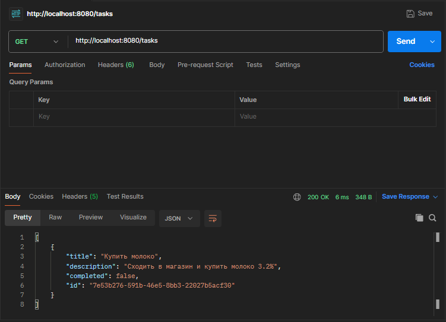
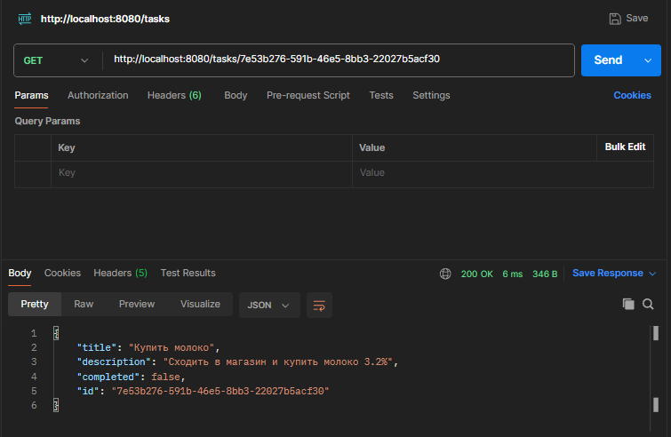
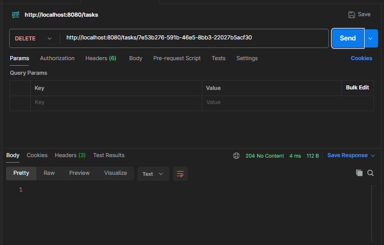

# Spring Boot Task Manager

Простое REST-приложение для управления списком задач на Spring Boot.

## 🛠️ Технологии
- Java 17+
- Spring Boot
- Spring Web

## 🚀 Запуск
1. Склонируйте проект
2. Запустите через `mvn spring-boot:run` или из вашей IDE
3. Сервер будет доступен на `http://localhost:8080`

## 🦐 Скриншоты запросов Postman

### POST — Создание задачи

### GET — Получение всех задач

### GET — Получение задачи по ID

### PUT — Обновление задачи

### DELETE — Удаление задачи

